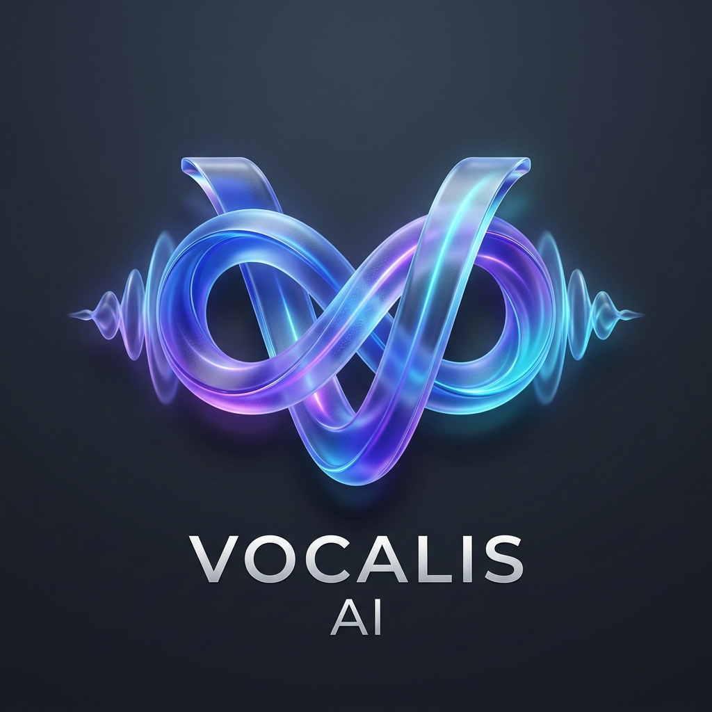

<p align="center">
  
</p>

# 🎙️ Vocalis AI — Real-Time Conversation & Technical Interview Copilot

🌐 **[Português (Brasil)](README.md)** | **[English](README.en.md)**

[](CHANGELOG.en.md)
[](LICENSE)
[](BRAND_BRIEF.en.md)
[](docs/USER_GUIDE.en.md)

Real-time meeting and interview assistant that transcribes audio, detects targeted questions, and generates contextual AI suggestions — featuring ultra-low latency, full i18n (`pt-BR`/`en`), and on-device local AI processing.

---

## 📚 Documentation Center

- 📘 [**User Guide**](docs/USER_GUIDE.en.md): Step-by-step instructions for installation, usage, and configuration.
- 🏗️ [**Technical Architecture**](docs/ARCHITECTURE.en.md): System diagrams, PCM audio pipeline, Chrome Built-in AI, and i18n engine.
- ⚙️ [**Environment Variables**](docs/ENVIRONMENT_VARIABLES.en.md): Complete `.env` reference guide.
- 🎨 [**Brand Briefing**](BRAND_BRIEF.en.md): Visual identity guidelines, 3D logo, color palette, and brand voice.
- 📜 [**Open-Source License**](LICENSE): Official text of the GNU General Public License v2.0 (GPLv2).
- 🏷️ [**Changelog**](CHANGELOG.en.md): Release history for version `v1.0.0`.

---

## 📋 Table of Contents

- [Overview](#overview)
- [Architecture](#architecture)
- [Prerequisites](#prerequisites)
- [Local Installation (Development)](#local-installation-development)
- [Docker Deployment (Production)](#docker-deployment-production)
- [Chrome Extension](#chrome-extension)
- [Configuration](#configuration)
- [Automated Testing](#automated-testing)
- [Usage](#usage)
- [API & Health Checks](#api--health-checks)
- [Troubleshooting](#troubleshooting)
- [Project Structure](#project-structure)

---

## Overview

The system captures meeting audio directly inside Chrome, filters silence locally using an RMS Energy Gate, transcribes speech with `faster-whisper` + Silero VAD, pre-processes technical jargon using **Chrome Built-in AI (Gemini Nano on-device)**, detects questions automatically, and presents contextual suggestions adapted to the active meeting mode — displayed in a floating overlay with instant local text rewriting.

```
Chrome (Meet/Teams) → Chrome Extension (Shadow DOM + On-Device Gemini Nano) → WebSocket → Node.js Orchestrator
                                                                                             ├── Whisper (Silero VAD)
                                                                                             └── LLM (Gemini / Claude / Ollama)
```

**Key Priorities**: Low latency (<3s), privacy (local audio & pre-processing), bandwidth/CPU optimization (VAD RMS), concise and adaptive responses.

---

## Architecture

| Component | Technology | Port | Description |
| :--- | :--- | :---: | :--- |
| **Chrome Extension** | React + TypeScript + Manifest V3 | — | PCM 16kHz audio capture, Shadow DOM HUD, TTS, Playwright E2E |
| **Orchestrator** | Node.js + Fastify + WS | `3001` | Core server: context, question detection, AI providers, meeting modes |
| **Transcription Service** | Python + FastAPI + faster-whisper | `8000` | Local speech-to-text with Silero VAD (`vad_filter=True`) |

---

## Prerequisites

- **Node.js**: `>=20.0.0`
- **npm**: `>=10.0.0`
- **Python**: `>=3.10` (for local transcription service)
- **Docker & Docker Compose** (optional, recommended for production)
- **NVIDIA GPU** with NVIDIA Container Toolkit (optional, for accelerated Whisper inference)
- **Google Gemini API Key** (or OpenAI / Anthropic / Ollama)

---

## Local Installation (Development)

1. **Clone the repository**:
   ```bash
   git clone https://github.com/edalicioh/vocalis-ai.git
   cd vocalis-ai
   ```

2. **Install workspace dependencies**:
   ```bash
   npm install
   ```

3. **Build shared types** (mandatory first step):
   ```bash
   npm run build:types
   ```

4. **Configure environment variables**:
   ```bash
   cp ".env copy.example" .env
   ```
   Edit `.env` and set your `GEMINI_API_KEY`.

5. **Start services**:
   - **Orchestrator**: `npm run dev:orchestrator`
   - **Transcription**: `cd apps/transcription-service && uvicorn main:app --port 8000`
   - **Extension**: `npm run dev:extension`

---

## Docker Deployment (Production)

```bash
# GPU profile (requires NVIDIA Container Toolkit)
docker compose --profile gpu up -d

# CPU profile (fallback)
docker compose --profile cpu up -d

# Development profile
docker compose --profile dev up -d
```

---

## License

Distributed under the **GNU General Public License v2.0 (`GPL-2.0-only`)**. See [LICENSE](LICENSE) for more information.
